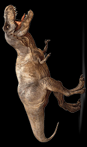

# LED Strip
Tools for drawing long exposure images with a NeoPixel LED strip
Basic Python that addresses LEDs on a 144 pixel strip and turns the LED the colour of the pixel in the image one row at a time.
Play with the update time per row to adjust the drawing time.

Suggested improvements:
- add image filename as an argument with the script is run rather than hardcoding it in the script
- use PIL to resize images to the required 144 pixel width and whatever height results so that any image can be used instead of a correctly sizes image being required.

![T-Rex end result photo] (DSC_4721.jpg "End result example, long expsure photo")
